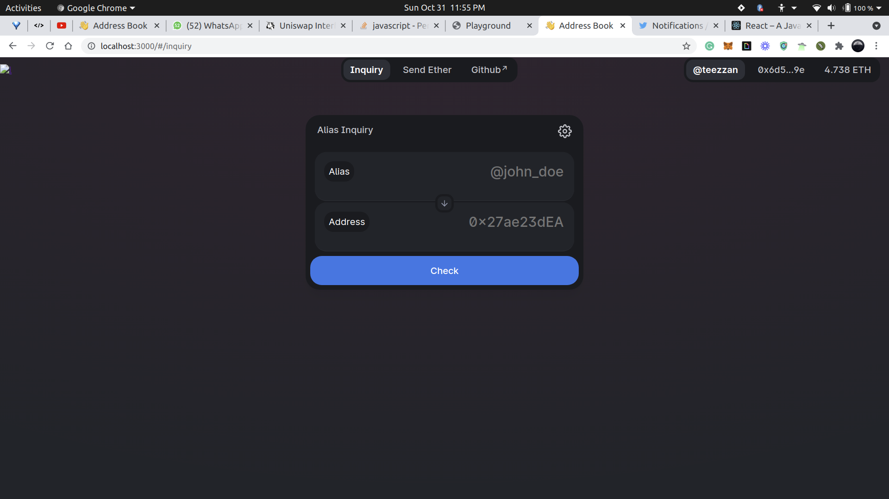
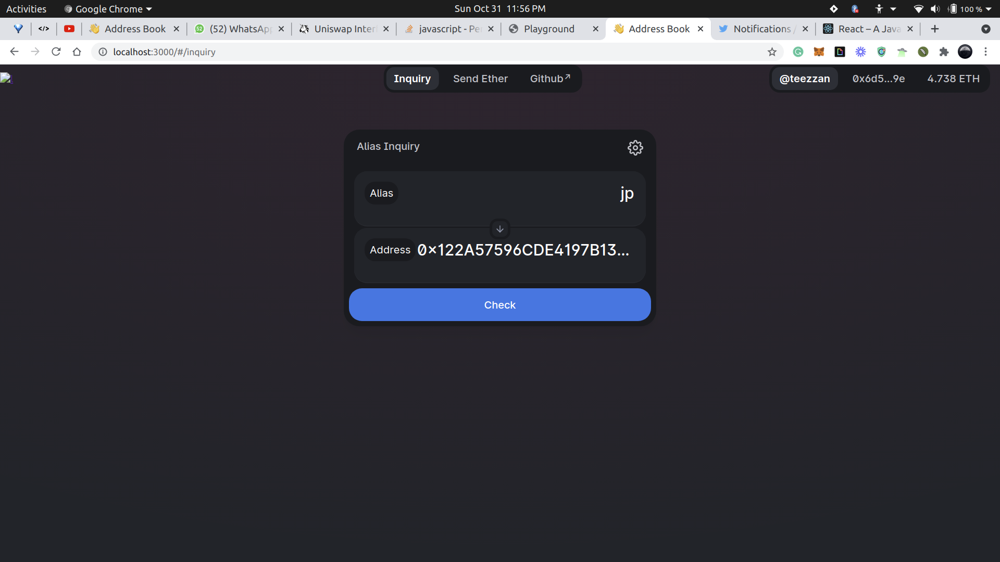
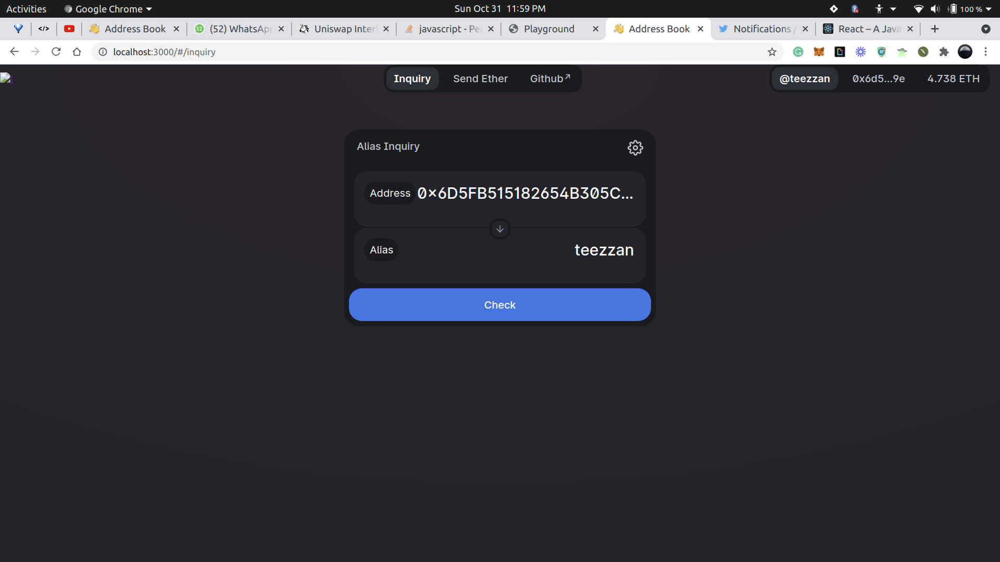
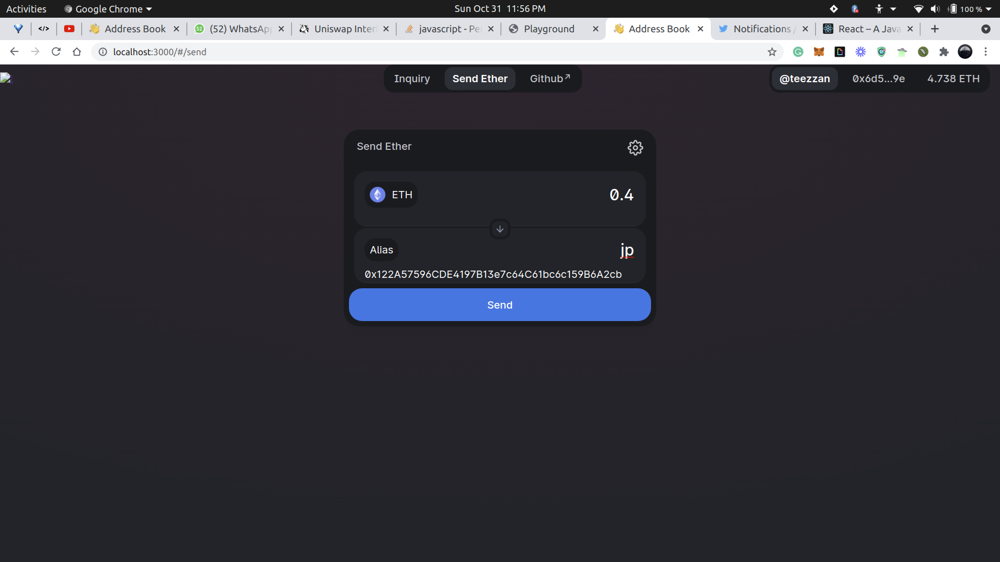
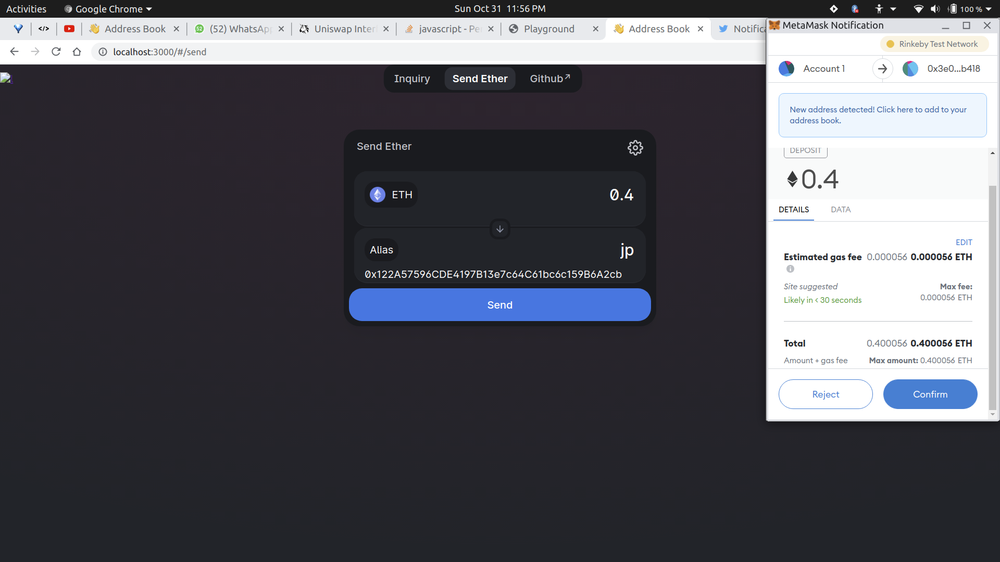

# AddressBook

## A simple and fast way of interacting with the blockchain.

If you have ever felt like you need a simple way to interact with the blockchain, this is it. It allows you to send ether to anyone using only a pre-choosen alias. Thats all. Seriously. 

## Screenshots & Demo.

## Built With

- [Solidity](https://docs.soliditylang.org/en/v0.8.9/)
- [HardHat](https://hardhat.org/)
- [ReactJS](https://reactjs.org/)

## Features

- Easy address inquiry
- Easy alias inquiry
- Customizable alias for everyone.
- Intuitive UI.
- Send Ether to aliases.

## Example Code
TBD
## Contributing

Issues and pull requests are welcome at [Address-Book-Portal(https://github.com/teezzan/Adress-Book-Portal). This project is intended to be safe, welcoming, and open for collaboration. Users are expected to adhere to the [Contributor Covenant code of conduct](https://www.contributor-covenant.org/version/2/0/code_of_conduct/). We are all human.

## Authors

**[Taiwo Yusuf](https://github.com/teezzan/)**

## Acknowledgments

**[Meg Gutshall](https://github.com/meg-gutshall/)** for her README template. Helped a lot.

## License
This project is licensed under the Apache License - see the [LICENSE.md](LICENSE.md) file for details.